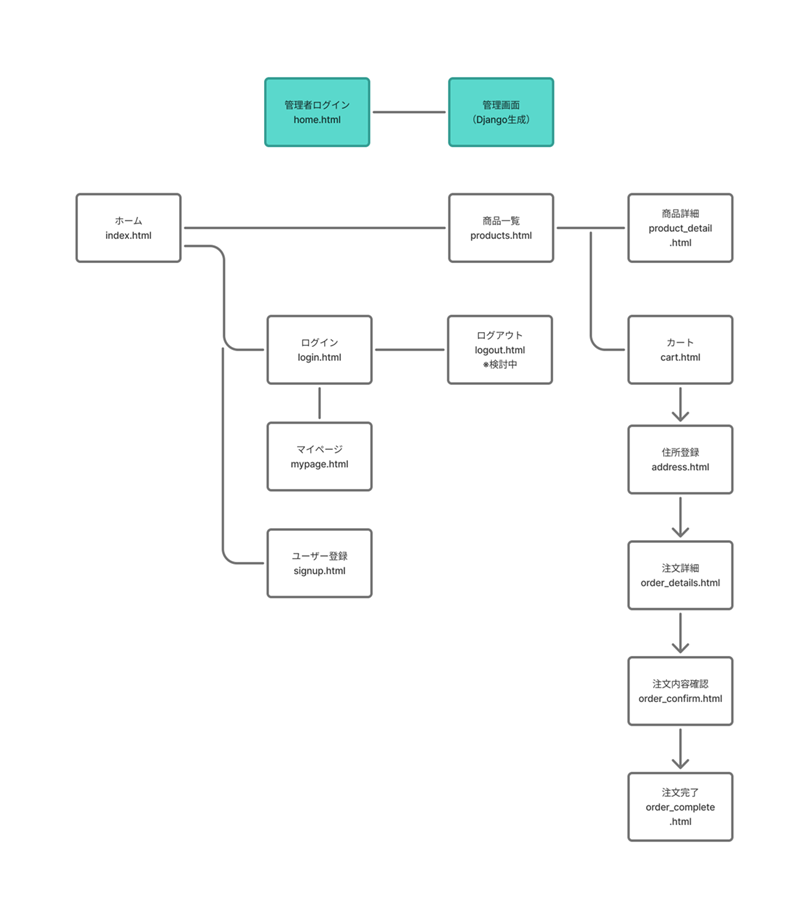
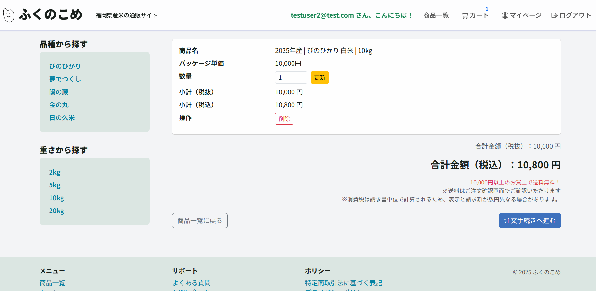
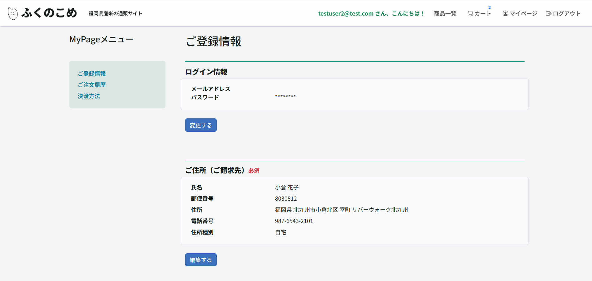
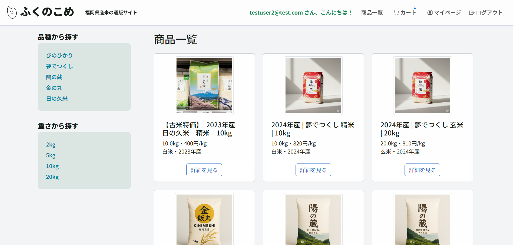

# ふくのこめEC (Django)

[YouTubeでデモを見る（限定公開）](https://www.youtube.com/watch?v=yFBFK0sBxP8)（別タブで開いてください）

Djangoで構成した、**架空のお米の通販ECサイト** です
- ユーザ登録
- ログイン
- カート管理
- 注文処理
- ユーザ個別ページ（マイページ）
- 管理者ページ  

を実装

## 概要
- Django 5 / Python 3.12　
- SQLite（開発） / 将来 Postgres 予定
- Docker Compose でワンコマンド起動

## アーキテクチャ(コンテナ構成)
[web (Django)]  
   ├─ (volume) SQLite DB  
   └─ (volume) static / media files  

## 主な機能
- 会員登録、配送先住所登録
- 商品一覧/詳細
- カート/注文（配送先スナップショット保存）
- 重量別の送料計算（段階制）
- Django Admin（受注確認/商品登録/配送・支払いステータス編集/商品名簡易登録ロジック等）

## セットアップ
```bash
# 初回セットアップ
docker compose build
docker compose up -d

# （db.sqlite3 がない場合のみ必要）
docker compose exec web python manage.py migrate

# 管理者ユーザーが未作成の場合
docker compose exec web python manage.py createsuperuser
```
Note:  
必要に応じて .env.example をコピーして .env を作成しし、KEYを書き換えてください  
  
  

## 画面遷移図


## 使用素材について
- タイトルロゴ：友人制作（許可を得て掲載）
- 商品画像・背景画像：AI生成（ChatGPT,Gemini利用）

## スクリーンショット




### ER図
後日更新します  